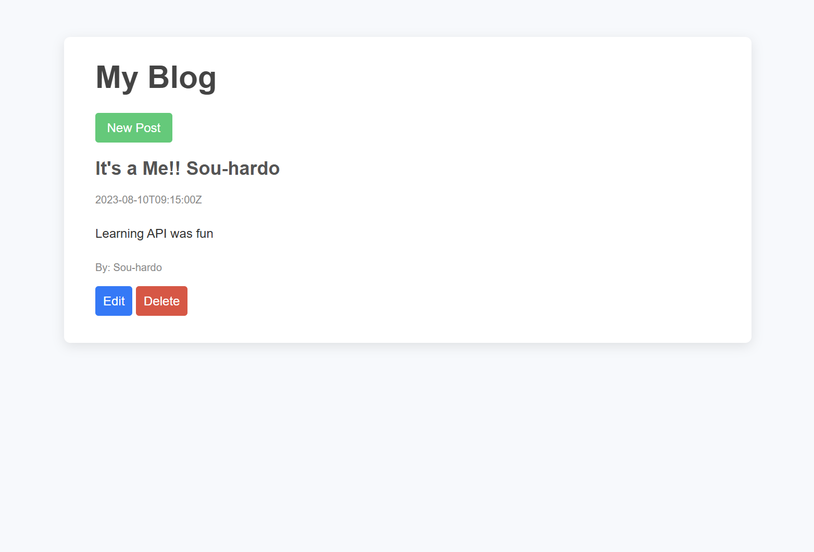

  

## Description
This project is a RESTful API designed for a blog application. It provides a set of endpoints to perform CRUD operations on blog posts, enabling users to create, retrieve, update, and delete content. Built with Node.js and Express.
