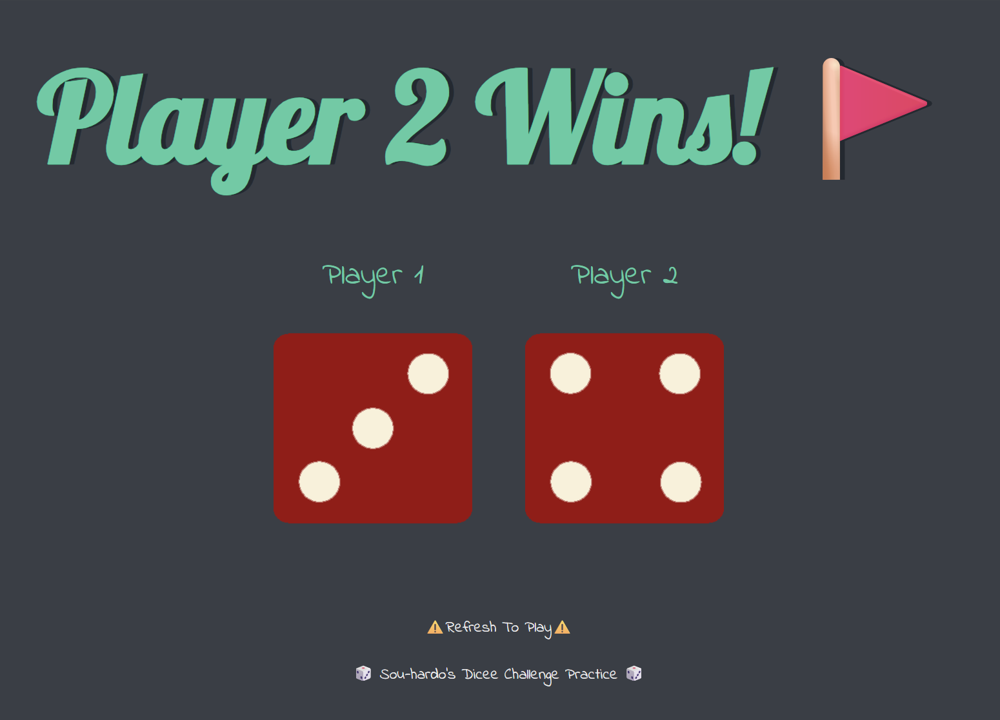

  

## Description
This is a simple dice game built with HTML, CSS, and JavaScript. It generates two random numbers between 1 and 6, displays the corresponding dice images, and announces the winner based on which player rolled the higher number.
