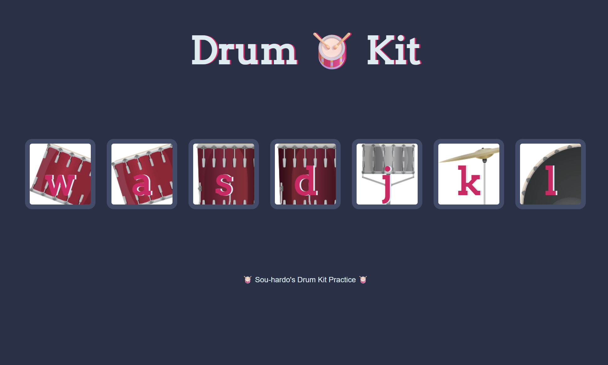

  

## Description
This is a simple drum kit built with HTML, CSS, and JavaScript. It allows users to play drum sounds by clicking on the drum images or by pressing the corresponding keys on the keyboard.
