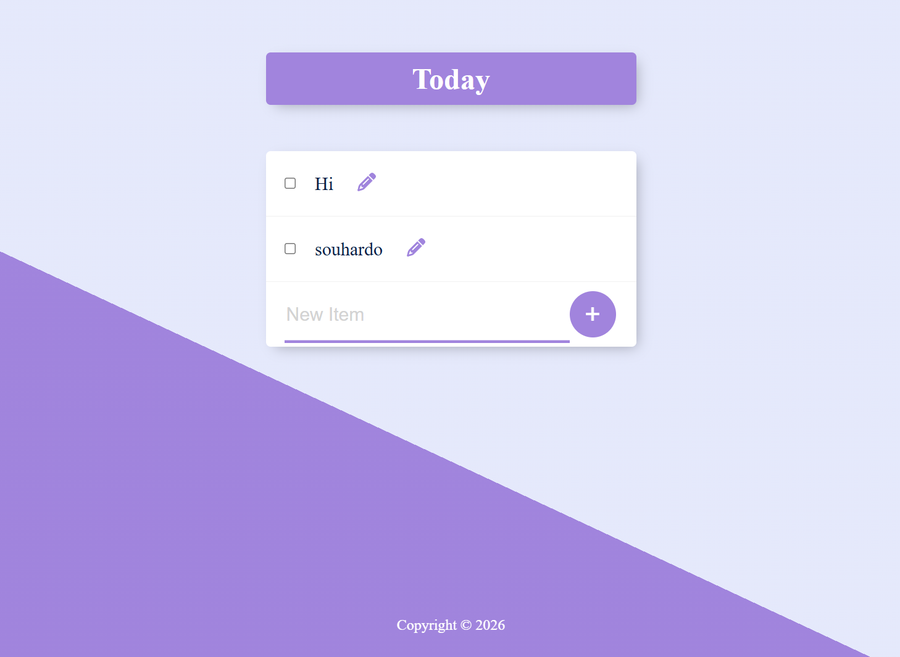

  

## Description
Permalist is a React-based note-taking application inspired by Google Keep. It allows users to manage their daily tasks and thoughts efficiently by adding and deleting notes in a clean, organized interface. This version uses PostgreSQL for data storage.