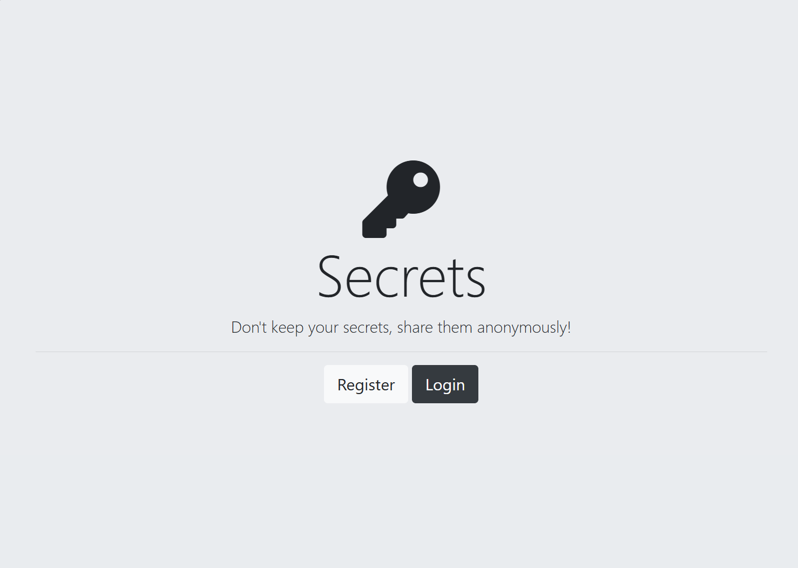
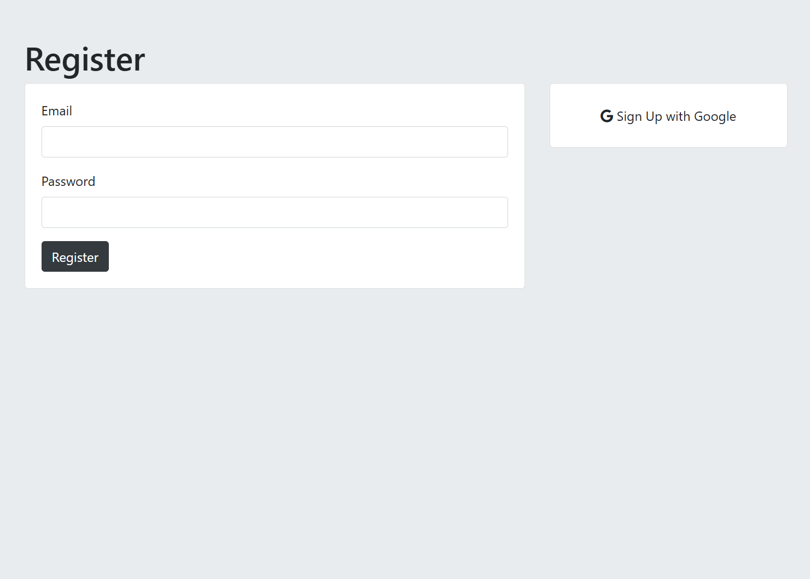
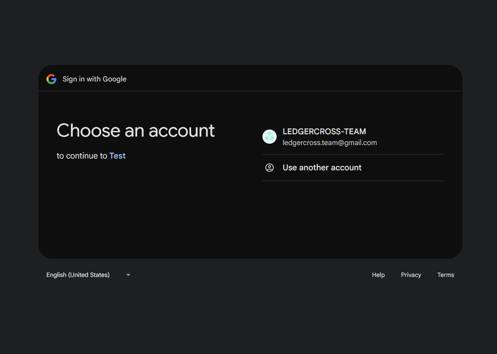
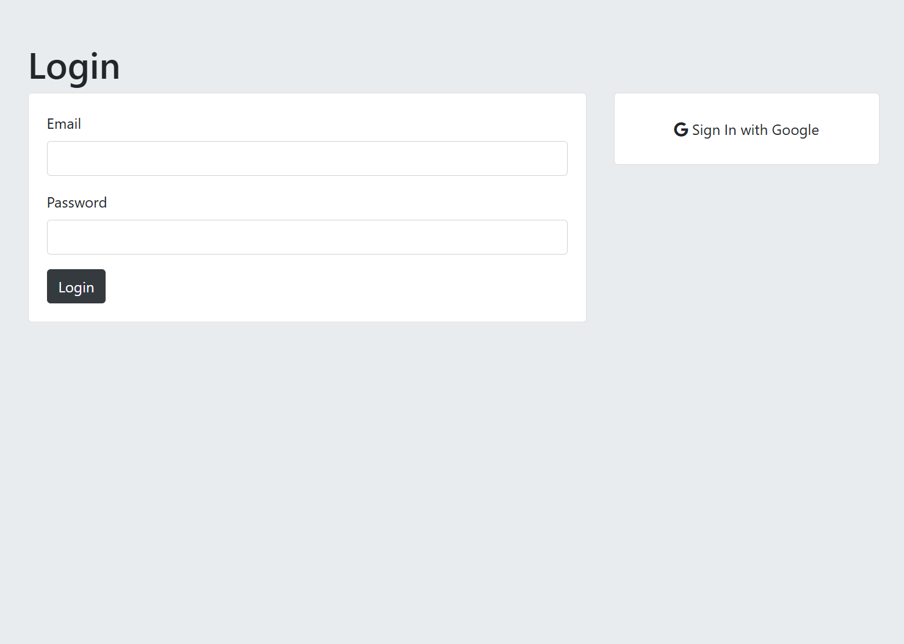
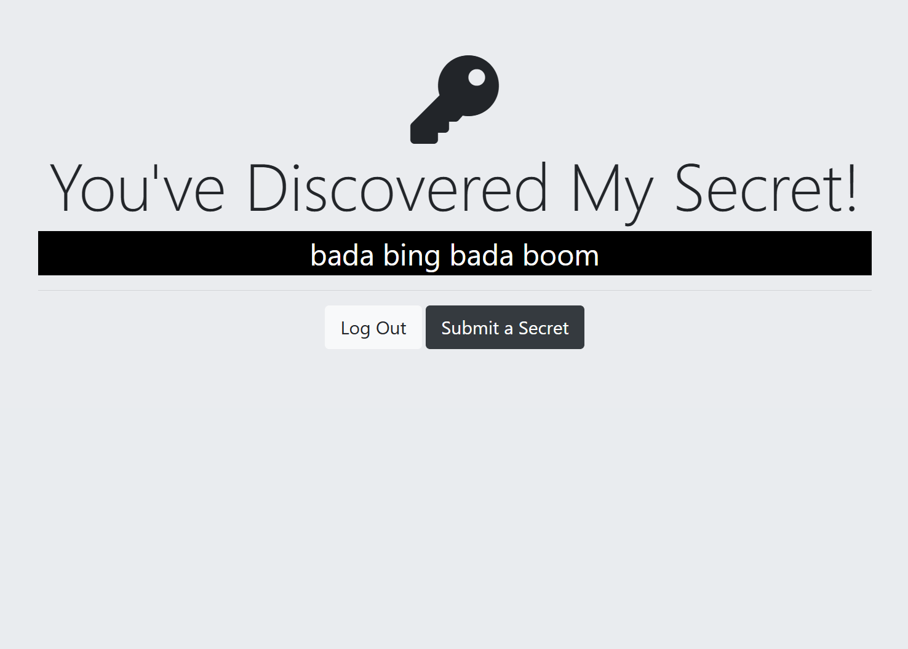
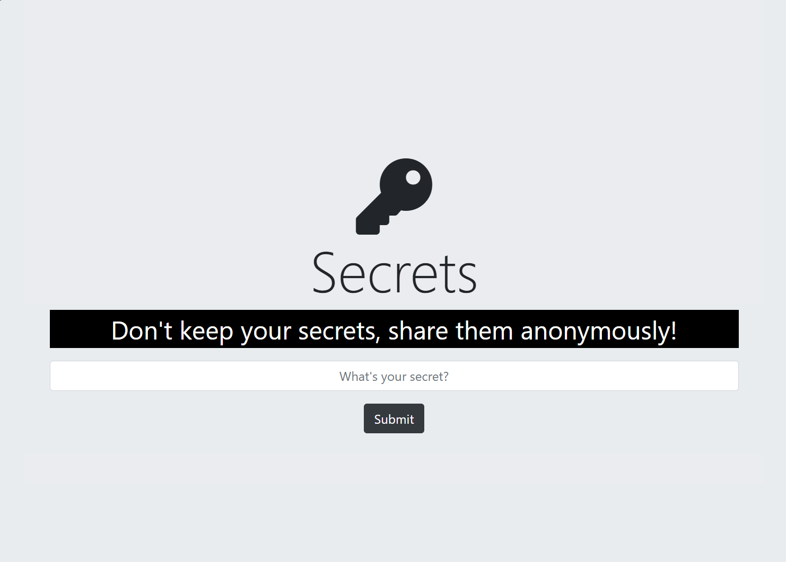

  

  

  

  

  

  

## Description
This project is a web application that allows users to share their secrets anonymously. It features user authentication including registration (OAuth - Google) and login functionality, ensuring that users can securely post and view secrets shared by others.