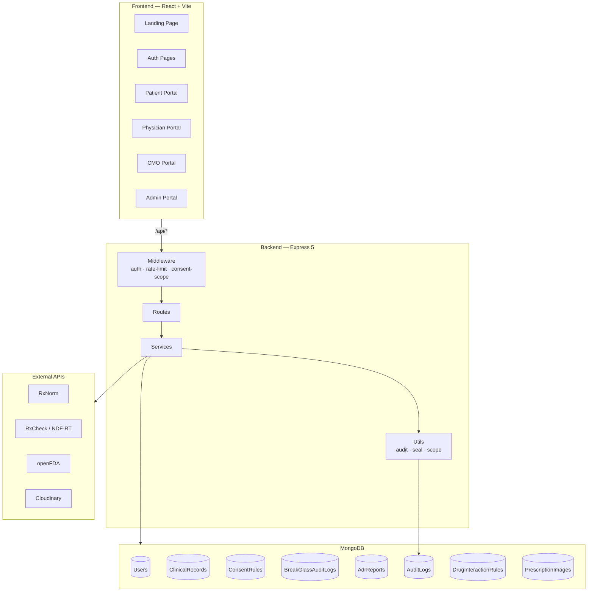
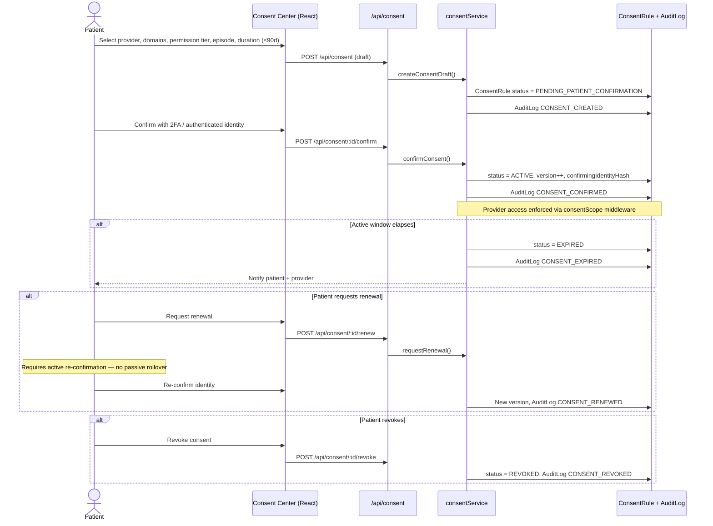
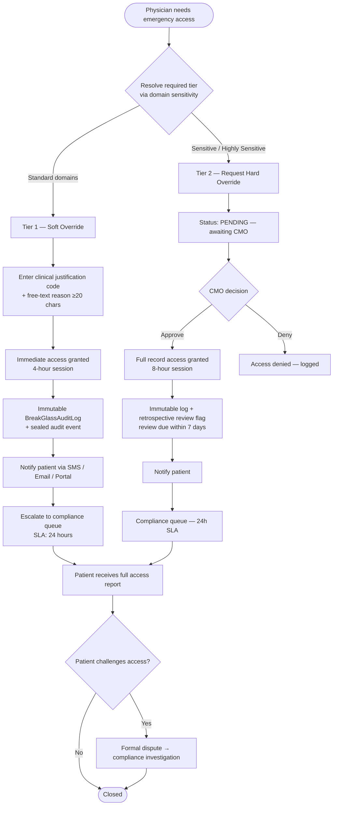
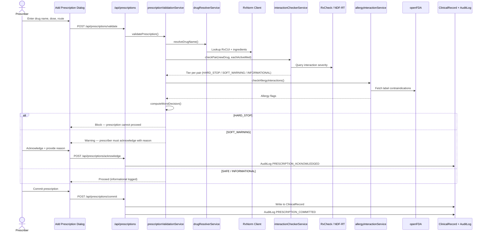
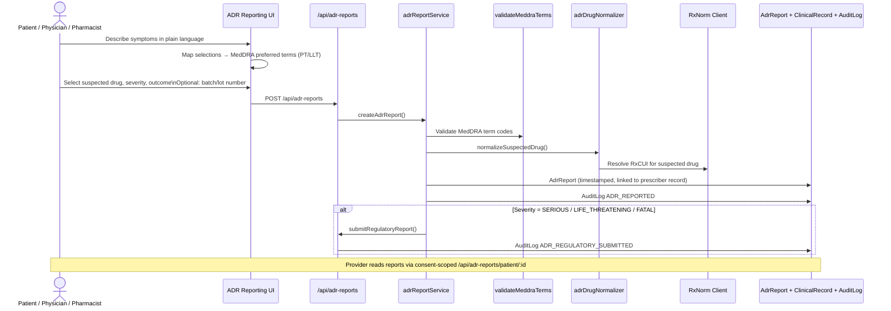

# NexusHealth

A full-stack healthcare platform built for granular patient consent, emergency clinical access, drug-interaction safety, and structured adverse drug reaction (ADR) reporting. NexusHealth gives patients control over who sees what in their record, while giving clinicians the tools they need in urgent care — with immutable audit trails throughout.

---

## Table of Contents

- [Features](#features)
- [Architecture](#architecture)
- [System Overview](#system-overview)
- [Workflows](#workflows)
  - [Feature 1 — Granular Consent Management](#feature-1--granular-consent-management)
  - [Feature 2 — Emergency Access Protocol (Break-Glass)](#feature-2--emergency-access-protocol-break-glass)
  - [Feature 3 — Drug Interaction & Contraindication Firewall](#feature-3--drug-interaction--contraindication-firewall)
  - [Feature 4 — Structured Adverse Drug Reaction Reporting](#feature-4--structured-adverse-drug-reaction-reporting)
- [User Roles & Routes](#user-roles--routes)
- [Project Structure](#project-structure)
- [Getting Started](#getting-started)
- [API Surface](#api-surface)
- [Testing](#testing)

---

## Features

### Feature 1 — Granular Consent Management

A patient grants their cardiologist read-only access to cardiac records and medication history, but explicitly excludes psychiatric records — for a **90-day window** tied to a specific referral episode.

- Consent automatically expires and notifies both parties; renewal requires **active re-confirmation**, not passive rollover
- **Permission tiers:** View-only, View + Add Notes, View + Add Prescriptions, Full Clinical Write Access
- **Consent versioning** — every change is logged with a timestamp and the patient's authenticated identity, creating a legally defensible audit trail

### Feature 2 — Emergency Access Protocol (Break-Glass)

- **Tier 1 (Soft Override):** An attending physician can invoke emergency access by entering a mandatory clinical justification code. Access is granted immediately and the patient is notified.
- **Tier 2 (Hard Override):** For critical care scenarios (ICU, OR), a hospital's designated Chief Medical Officer (CMO) account can authorize emergency access to a patient's full record, with a mandatory retrospective review flag.
- Every break-glass event triggers an **immutable log entry** and is automatically escalated to the platform's compliance review queue within **24 hours**.
- Post-emergency, the patient receives a full access report and can challenge any unauthorized access through a formal dispute workflow.

### Feature 3 — Rule-Based Drug Interaction & Contraindication Firewall

Powered by **RxNorm** and **NDF-RT** terminology:

- Validates every new prescription entry against the patient's existing medication list and documented allergy profile
- Flags are tiered:
  - **Hard Stop** — known fatal interactions
  - **Soft Warning** — significant risk; requires prescriber acknowledgment with reason
  - **Informational** — minor interaction; logged only

### Feature 4 — Structured Adverse Drug Reaction (ADR) Reporting

- Patients log symptoms through a guided, structured UI that maps plain-language descriptions to standardized **MedDRA** (Medical Dictionary for Regulatory Activities) terminology behind the scenes
- Entries are timestamped, linked to the specific medication batch/lot number when available, and tied to the prescribing physician's record

---

## Architecture

NexusHealth is a **monorepo** with a React SPA frontend and an Express REST API backend, backed by MongoDB.

### Frontend (`frontend/`)

| Layer | Technology |
|---|---|
| Runtime | React 19 |
| Build tool | Vite 8 |
| Routing | React Router DOM 7 |
| State / API | Redux Toolkit 2 + RTK Query |
| UI primitives | Radix UI (Dialog, Label, Select, Slot) |
| Styling | Tailwind CSS 3 + DaisyUI 5 |
| Icons | Lucide React |
| Utilities | clsx, class-variance-authority, tailwind-merge |

**Dev server:** `http://localhost:5173` — proxies `/api` → backend on port `5000`.

### Backend (`backend/`)

| Layer | Technology |
|---|---|
| Runtime | Node.js (CommonJS) |
| HTTP framework | Express 5 |
| Database | MongoDB via Mongoose 9 |
| Authentication | JWT (jsonwebtoken) + bcryptjs |
| File uploads | Multer → Cloudinary |
| Security | express-rate-limit, cookie-parser |
| Config | dotenv |
| Testing | Jest 30 + Supertest + mongodb-memory-server |

**API server:** `http://localhost:5000`

### External Integrations

| Service | Purpose |
|---|---|
| **RxNorm API** | Drug name → RxCUI resolution, ingredient lookup |
| **RxCheck / NDF-RT** | Drug–drug interaction severity classification |
| **openFDA** | Drug label excerpts for allergy/contraindication checks |
| **Cloudinary** | Secure storage for physical prescription images |
| **MedDRA terminology** | Standardized ADR symptom coding (validated server-side) |

---

## System Overview



---

## Workflows

### Feature 1 — Granular Consent Management



**Permission tiers**

| Tier | Capabilities |
|---|---|
| `VIEW_ONLY` | Read allowed clinical domains |
| `VIEW_ADD_NOTES` | View + append clinical notes |
| `VIEW_ADD_PRESCRIPTIONS` | View + write prescriptions |
| `FULL_WRITE` | Full clinical write access within allowed domains |

**Domain scoping example:** `allowedDomains: [CARDIOLOGY]` + `excludedDomains: [PSYCHIATRY]` → cardiologist sees cardiac records and meds, never psychiatric data.

---

### Feature 2 — Emergency Access Protocol (Break-Glass)



**Break-glass tiers**

| Tier | Who | Access | Session | Review |
|---|---|---|---|---|
| `TIER_1_SOFT_OVERRIDE` | Attending physician | Scoped domains | 4 hours | Compliance queue within 24h |
| `TIER_2_HARD_OVERRIDE` | CMO-approved | Full clinical record | 8 hours | Mandatory retrospective review (7 days) |

**Clinical justification codes:** `EMERGENCY_DEPARTMENT`, `UNCONSCIOUS_PATIENT`, `LIFE_THREATENING_EVENT`, `TRANSFER_OF_CARE`

---

### Feature 3 — Drug Interaction & Contraindication Firewall



**Flag tiers**

| Tier | Behavior | Prescriber action |
|---|---|---|
| `HARD_STOP` | Known fatal / contraindicated interaction | Prescription blocked |
| `SOFT_WARNING` | Significant risk (moderate interaction or allergy match) | Must acknowledge with documented reason |
| `INFORMATIONAL` | Minor interaction | Logged; no block |

**Data sources:** Local `DrugInteractionRule` cache → RxCheck/NDF-RT live lookup → openFDA allergy label cross-check.

---

### Feature 4 — Structured Adverse Drug Reaction Reporting



**ADR severity levels:** `NON_SERIOUS`, `SERIOUS`, `LIFE_THREATENING`, `FATAL`

**Reporter roles:** `PATIENT`, `PHYSICIAN`, `PHARMACIST`

---

## User Roles & Routes

| Role | Frontend base path | Key capabilities |
|---|---|---|
| `PATIENT` | `/patient/*` | Dashboard, prescriptions, doctors, physical prescriptions, consent center |
| `PHYSICIAN` | `/doctor/*` | Dashboard, patient list, break-glass, prescription management |
| `CMO` | `/cmo/*` | Dashboard, Tier-2 approval queue, compliance review |
| `PHARMACIST` | `/doctor/dashboard` | Prescription visibility, ADR submission |
| `ADMIN` | `/admin/*` | User invitation, platform administration |

---

## Project Structure

```
NexusHealth/
├── frontend/
│   ├── src/
│   │   ├── app/              # Router, Redux store, RTK Query base API
│   │   ├── components/       # Shared UI (layout, feedback, shadcn-style primitives)
│   │   ├── features/
│   │   │   ├── auth/         # Login, signup, role guards, JWT bootstrap
│   │   │   ├── consent/      # Consent Center, timeline, action modals
│   │   │   ├── breakGlass/   # Emergency access UI, CMO compliance queue
│   │   │   ├── prescriptions/# Drug search, interaction warnings, Rx management
│   │   │   ├── dashboard/    # Role-specific dashboards
│   │   │   ├── patients/     # Physician patient list + consent cards
│   │   │   ├── doctors/      # Patient care-team management
│   │   │   ├── physicalPrescriptions/  # Image upload + lightbox
│   │   │   ├── admin/        # User invitation
│   │   │   └── landing/      # Public marketing page
│   │   └── lib/              # API client, theme, utilities
│   └── package.json
│
└── backend/
    ├── server.js             # Express app entry + route mounting
    ├── routes/               # REST route handlers
    ├── services/             # Business logic (consent, break-glass, Rx, ADR)
    ├── models/               # Mongoose schemas
    ├── middleware/           # Auth, rate-limit, consent-scope enforcement
    ├── utils/                # Audit writer, seal events, scope helpers
    ├── config/               # Enums, DB connection, indexes
    ├── scripts/              # DB init, seed users, MRN backfill
    ├── tests/                # Jest integration + unit tests
    └── package.json
```

---

## Getting Started

### Prerequisites

- Node.js 18+
- MongoDB (local or Atlas)
- Cloudinary account (for prescription image uploads)

### Backend setup

```bash
cd backend
cp .env.example .env
# Edit .env with your MongoDB URI, JWT secrets, and Cloudinary credentials

npm install
npm run db:init          # Create indexes
npm run db:seed-users    # Seed development users (optional)
npm run dev              # Start on http://localhost:5000
```

### Frontend setup

```bash
cd frontend
cp .env.example .env

npm install
npm run dev              # Start on http://localhost:5173
```

### Environment variables

**Backend (`backend/.env`)**

| Variable | Description |
|---|---|
| `MONGO_URI` | MongoDB connection string |
| `JWT_SECRET` | Access token signing secret |
| `JWT_REFRESH_SECRET` | Refresh token signing secret |
| `JWT_ACCESS_TTL` | Access token lifetime (default `15m`) |
| `JWT_REFRESH_TTL` | Refresh token lifetime (default `7d`) |
| `AUDIT_SEAL_SECRET` | HMAC secret for immutable audit event sealing |
| `PORT` | API port (default `5000`) |
| `CLOUDINARY_URL` | Cloudinary upload credentials |

**Frontend (`frontend/.env`)**

| Variable | Description |
|---|---|
| `VITE_API_BASE_URL` | API base URL (empty for Vite dev proxy) |
| `VITE_DEV_AUTH` | Enable dev auth shortcuts (`false` in production) |

---

## API Surface

| Prefix | Domain |
|---|---|
| `/api/auth` | Registration, login, token refresh, logout |
| `/api/users` | Profile and user lookup |
| `/api/admin/users` | Admin user invitation |
| `/api/consent` | Consent CRUD, confirm, renew, revoke, expire |
| `/api/clinical-records` | Scoped clinical record read/write |
| `/api/break-glass` | Tier-1 override, Tier-2 request/approve/deny, compliance queue |
| `/api/drugs` | RxNorm drug search and resolution |
| `/api/prescriptions` | Validate, acknowledge, commit, discontinue, polypharmacy check |
| `/api/adr-reports` | ADR submission, patient listing, regulatory submit |
| `/api/prescription-images` | Physical prescription image upload and access |
| `/api/meta` | Platform enums and reference data |
| `/health` | Database connectivity check |

---

## Testing

```bash
cd backend
npm test                 # Run all Jest tests (in-band)
npm run test:watch       # Watch mode
```

Test coverage includes consent lifecycle, break-glass transactions, interaction checking, ADR validation, audit log integrity, and full route integration via Supertest.
