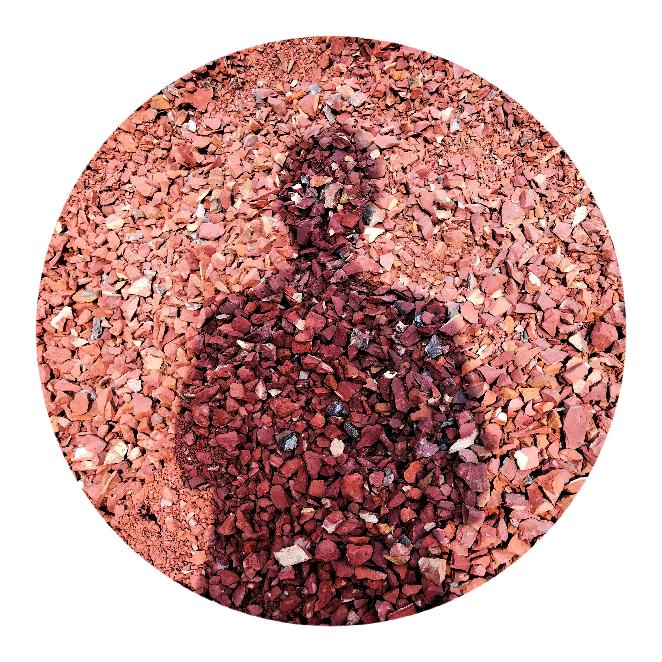

  

# Course Projects: Assignments & Capstone Submissions

---

### Souhardo's Submissions Index

#### Blockchain_Coursera

| Submission Name  | Link to Files                                        |
| :--------------- | :--------------------------------------------------- |
| C2_1_Auction.sol | [View Files](./Blockchain_Coursera/C2_1_Auction.sol) |
| C2_2_Auction.sol | [View Files](./Blockchain_Coursera/C2_2_Auction.sol) |

#### Blockchain_Udemy

| Submission Name | Link to Files |
| :-------------- | :------------ |
| (Add entries)   | -             |

#### Full_Stack_Udemy

| Submission Name  | Link to Files                                        |
| :--------------- | :--------------------------------------------------- |
| Band Generator   | [View Project](./Full_Stack_Udemy/Band_Generator/)   |
| Blog API         | [View Project](./Full_Stack_Udemy/Blog_API/)         |
| Dice Challenge   | [View Project](./Full_Stack_Udemy/Dice_Challenge/)   |
| Drum Kit         | [View Project](./Full_Stack_Udemy/Drum_Kit/)         |
| Keeper           | [View Project](./Full_Stack_Udemy/Keeper/)           |
| Permalist        | [View Project](./Full_Stack_Udemy/Permalist/)        |
| QR Code          | [View Project](./Full_Stack_Udemy/QR_Code/)          |
| Secrets1 S24 207 | [View Project](./Full_Stack_Udemy/Secrets1_S24_207/) |
| Secrets2 S28 231 | [View Project](./Full_Stack_Udemy/Secrets2_S28_231/) |
| Secrets3 S35 275 | [View Project](./Full_Stack_Udemy/Secrets3_S35_275/) |
| Simon Game       | [View Project](./Full_Stack_Udemy/Simon_Game/)       |
| Travel Tracker   | [View Project](./Full_Stack_Udemy/Travel_Tracker/)   |
| Capstone (1-5)   | [View Project](https://github.com/Sou-hardo/portfolio) |

#### GenAI_Coursera

| Submission Name                  | Link to Files |
| :------------------------------- | :------------ |
| Classifying Document             | [View Files](./GenAI_Coursera/Classifying%20Document.ipynb)              |
| Creating an NLP Data Loader      | [View Files](./GenAI_Coursera/Creating%20an%20NLP%20Data%20Loader.ipynb) |
| Exploring Generative AI Libraries | [View Files](./GenAI_Coursera/Exploring_Generative_AI_Libraries.ipynb)  |
| Implementing Tokenization         | [View Files](./GenAI_Coursera/Implementing%20Tokenization.ipynb)        |
| Feed Forward NN                   | [View Files](./GenAI_Coursera/FeedForwardNeuralNetworks.ipynb)          |
| Language Modelling                | [View Files](./GenAI_Coursera/LanguageModelling.ipynb)                  |
| Word2Vec Part-1                   | [View Files](./GenAI_Coursera/Integrating%20Word2Vec%20Part1.ipynb)     |
| Word2Vec Part-2                   | [View Files](./GenAI_Coursera/Integrating%20Word2Vec%20Part2.ipynb)     |
| Seq-to-Seq Model                  | [View Files](./GenAI_Coursera/Developing%20a%20Sequence-to-Sequence%20Model.ipynb)     |
| Attn. Mechanism & Pos. Embedding  | [View Files](./GenAI_Coursera/Attention%20Mechanism%20and%20Positional%20Encoding.ipynb)     |

---
