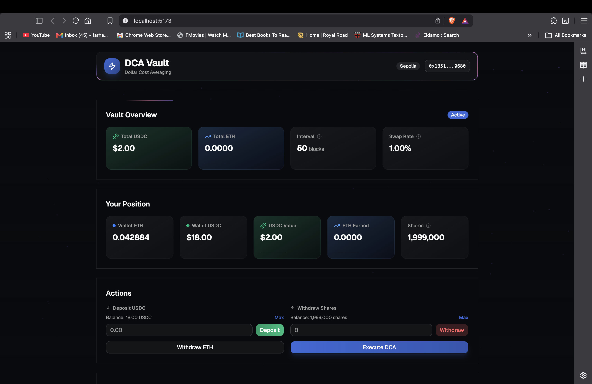
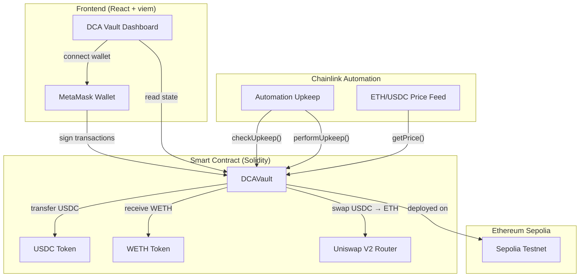
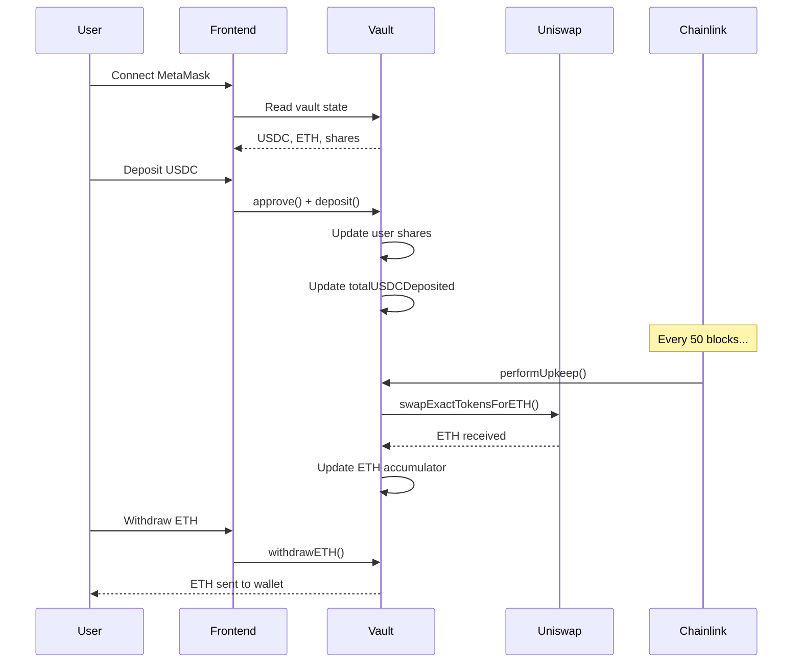

# DCA Vault

A decentralized Dollar Cost Averaging (DCA) protocol that automatically converts deposited USDC into ETH on a fixed block interval via Uniswap V2. Built with Solidity/Foundry on the backend and React + shadcn/ui on the frontend.



---

## What It Does

Dollar Cost Averaging is an investment strategy where you invest a fixed amount at regular intervals, reducing the impact of volatility. **DCA Vault** automates this on-chain:

1. **Deposit USDC** into the vault
2. **Automated swaps** convert 1% of your deposit into ETH every 50 blocks
3. **Track your position** — see your USDC value and ETH earned in real-time
4. **Withdraw** your USDC or accumulated ETH anytime

No manual trading. No timing the market. Just deposit and let the vault work.

---

## Architecture



### Data Flow



---

## Tech Stack

### Smart Contract

| Component | Technology |
|-----------|-----------|
| Language | Solidity 0.8.30 |
| Framework | Foundry (forge, anvil) |
| Security | OpenZeppelin v5 (Ownable2Step, ReentrancyGuard, Pausable, SafeERC20) |
| Automation | Chainlink Automation (checkUpkeep / performUpkeep) |
| Price Feed | Chainlink AggregatorV3Interface |
| DEX | Uniswap V2 Router |
| Testnet | Ethereum Sepolia |

### Frontend

| Component | Technology |
|-----------|-----------|
| Framework | React 19 + TypeScript |
| Build | Vite |
| Styling | Tailwind CSS v4 |
| Components | shadcn/ui (base-nova) |
| Wallet | viem |
| Animations | Flickering Grid, Particles, MagicCard, BorderBeam, ShineBorder |

---

## Smart Contract Features

### Core Functions

| Function | Description |
|----------|-------------|
| `deposit(uint256 amount)` | Deposit USDC, receive vault shares proportional to your contribution |
| `withdraw(uint256 shares)` | Burn shares to withdraw your proportional USDC from the vault |
| `executeDCA()` | Manually trigger a DCA swap (1% of total USDC → ETH via Uniswap) |
| `withdrawETH()` | Withdraw your earned ETH based on your share of the vault |

### Admin Functions

| Function | Description |
|----------|-------------|
| `pause()` / `unpause()` | Emergency pause mechanism (Pausable) |
| `setDcaIntervalBlocks(uint256)` | Change the block interval between swaps |
| `setDcaPercentage(uint256)` | Change the swap percentage (basis points, e.g. 100 = 1%) |
| `setSlippageBps(uint256)` | Set max slippage tolerance (default 2%, max 10%) |
| `transferOwnership(address)` | Transfer admin rights (Ownable2Step — requires acceptance) |

### Automated DCA (Chainlink)

- `checkUpkeep()` — Called by Chainlink nodes every block to check if DCA should run
- `performUpkeep()` — Executes the swap when conditions are met (interval elapsed, vault has USDC)
- `getAmountOutMin()` — Calculates minimum ETH output using Chainlink price feed + slippage buffer

### Security

- **ReentrancyGuard** — Prevents reentrancy attacks on deposit/withdraw/swap functions
- **Pausable** — Emergency pause for all user operations
- **Ownable2Step** — Two-step ownership transfer (prevents accidental transfers)
- **SafeERC20** — Safe token transfers for non-standard ERC20 (USDC)
- **Input validation** — Constructor validates addresses, interval, percentage; slippage capped at 10%

### ETH Earning Model

Uses a real-time accumulator pattern (ERC-4626 standard):

- `ethPerShare` — Accumulated ETH per share, scaled by 1e27 for precision
- `userETHCompensated` — Tracks ETH already claimed by each user
- When a swap occurs, ETH is added to the accumulator proportional to each user's share

---

## Frontend Features


| Feature | Description |
|---------|-------------|
| **Wallet Connection** | Connect MetaMask, auto-reconnect on refresh |
| **Vault Overview** | Total USDC deposited, total ETH accumulated, interval, swap rate |
| **Your Position** | Wallet balances, USDC value in vault, ETH earned, share count |
| **Deposit USDC** | Approve + deposit in one flow, with Max button |
| **Withdraw Shares** | Burn shares to reclaim proportional USDC |
| **Withdraw ETH** | Claim earned ETH to your wallet |
| **Execute DCA** | Manually trigger a swap (requires ETH for gas) |
| **DCA History** | Table of all past swaps with block links to Etherscan |
| **Animated Background** | Interactive particles + grid animations |
| **Responsive** | Works on desktop and mobile |

---

## Setup

### Prerequisites

- [Node.js](https://nodejs.org/) v18+
- [Foundry](https://book.getfoundry.sh/getting-started/installation) (forge, anvil)
- [MetaMask](https://metamask.io/) browser extension
- Sepolia ETH (from a faucet)

### Smart Contract

```bash
# Clone the repo
git clone https://github.com/farhan-9820/blockchain_project_ether.git
cd blockchain_project_ether

# Install dependencies
forge install

# Build
forge build

# Test (105 tests)
forge test

# Deploy to Sepolia
source .env
forge script script/Deploy.s.sol --rpc-url $SEPOLIA_RPC --broadcast
```

### Frontend

```bash
# Navigate to frontend
cd dca-vault-ui

# Install dependencies
npm install

# Start dev server
npm run dev
# → http://localhost:5173
```

### Environment Variables

Create `.env` in the project root:

```env
SEPOLIA_RPC=https://eth-sepolia.g.alchemy.com/v2/YOUR_KEY
DEPLOYER_PRIVATE_KEY=your_private_key
DEPLOYER_ADDRESS=your_address
ETHERSCAN_API_KEY=your_api_key
```

The frontend `.env` is pre-configured for Sepolia:

```env
VITE_RPC_URL=https://eth-sepolia.g.alchemy.com/v2/YOUR_KEY
VITE_VAULT_ADDRESS=0xf525504762f313862ed910465db2e5f2e7ca34ae
VITE_USDC_ADDRESS=0x1c7D4B196Cb0C7B01d743Fbc6116a902379C7238
VITE_ETHERSCAN_URL=https://sepolia.etherscan.io
```

---

## Deployed Contracts

| Contract | Address | Chain |
|----------|---------|-------|
| DCAVault | [`0xf525504762f313862ed910465db2e5f2e7ca34ae`](https://sepolia.etherscan.io/address/0xf525504762f313862ed910465db2e5f2e7ca34ae) | Sepolia (11155111) |

### Constructor Arguments

| Arg | Value | Description |
|-----|-------|-------------|
| `usdc` | `0x1c7D4B196Cb0C7B01d743Fbc6116a902379C7238` | Sepolia USDC |
| `weth` | `0x7b79995e5f793A07Bc00c21412e50Ecae098E7f9` | Sepolia WETH |
| `router` | `0xC532a74256D3DB42D0Bf7a0400fEFDbad7694008` | Uniswap V2 Router |
| `dcaIntervalBlocks` | `50` | Blocks between swaps |
| `dcaPercentage` | `100` | 1% of vault USDC per swap |
| `priceFeed` | `0x694AA1769357215DE4FAC081bf1f309aDC325306` | Chainlink ETH/USD |

---

## Testing

### Smart Contract Tests (105 total)

```bash
# Run all tests
forge test

# Run specific test suite
forge test --match-path test/DCAVault.t.sol           # 25 unit/fuzz tests
forge test --match-path test/DCAVault.phaseB.t.sol    # 29 OZ integration tests
forge test --match-path test/DCAVault.phaseC.t.sol    # 19 Chainlink automation tests
forge test --match-path test/DCAVault.phaseD.t.sol    # 16 ETH withdrawal tests
forge test --match-path test/DCAVault.invariants.t.sol # 3 invariant tests
forge test --match-path test/DCAVault.integration.t.sol # 1 lifecycle test
forge test --match-path test/DCAVault.fork.t.sol      # 4 Sepolia fork tests

# With verbose output
forge test -vvv

# Coverage
forge coverage

# Gas report
forge snapshot
```

### Local Development (Anvil)

```bash
# Start local node
anvil

# Deploy locally
forge script script/DeployLocal.s.sol \
  --rpc-url http://127.0.0.1:8545 \
  --broadcast \
  --private-key 0xac0974bec39a17e36ba4a6b4d238ff944bacb478cbed5efcae784d7bf4f2ff80
```

---

## Project Structure

```
blockchain_project_ether/
├── src/
│   ├── DCAVault.sol                    # Main contract (~290 LOC)
│   ├── interfaces/
│   │   ├── IAutomationCompatible.sol   # Chainlink Automation interface
│   │   └── IAggregatorV3.sol           # Chainlink Price Feed interface
│   └── mocks/
│       ├── MockUSDC.sol                # Test USDC token
│       ├── MockWETH.sol                # Test WETH token
│       ├── MockRouter.sol              # Test Uniswap router
│       └── MockPriceFeed.sol           # Test Chainlink price feed
├── test/
│   ├── DCAVault.t.sol                  # Unit & fuzz tests
│   ├── DCAVault.phaseB.t.sol           # OpenZeppelin integration tests
│   ├── DCAVault.phaseC.t.sol           # Chainlink automation tests
│   ├── DCAVault.phaseD.t.sol           # ETH withdrawal tests
│   ├── DCAVault.invariants.t.sol       # Invariant tests
│   ├── DCAVault.integration.t.sol      # Anvil lifecycle test
│   └── DCAVault.fork.t.sol             # Sepolia fork tests
├── script/
│   ├── Deploy.s.sol                    # Sepolia deployment
│   └── DeployLocal.s.sol               # Local Anvil deployment
├── dca-vault-ui/                       # Frontend
│   ├── src/
│   │   ├── App.tsx                     # Main application
│   │   ├── components/ui/              # shadcn/ui components
│   │   └── lib/
│   │       ├── contract.ts             # Contract read/write helpers
│   │       ├── viem.ts                 # Viem client setup
│   │       └── abi.ts                  # Contract ABI
│   └── .env                            # Frontend environment
├── foundry.toml                        # Foundry config
└── .env                                # Contract environment
```

---

## How It Connects

### MetaMask Setup

1. Install MetaMask browser extension
2. Add Sepolia testnet (Chain ID: 11155111)
3. Get Sepolia ETH from a faucet:
   - https://sepoliafaucet.com
   - https://faucets.chain.link/sepolia
4. Get Sepolia USDC from Alchemy faucet (if available)
5. Open `http://localhost:5173`
6. Click **Connect Wallet** in the header
7. Approve the connection in MetaMask

### Transaction Flow

| Action | What Happens |
|--------|-------------|
| **Deposit** | MetaMask prompts → approve USDC → deposit USDC → receive vault shares |
| **Withdraw** | MetaMask prompts → burn shares → receive proportional USDC |
| **Execute DCA** | MetaMask prompts → swap USDC → ETH via Uniswap V2 |
| **Withdraw ETH** | MetaMask prompts → ETH sent to your wallet |

> **Note:** Execute DCA requires ETH for gas fees on Sepolia. The contract must also have USDC deposited and the block interval must have elapsed since the last swap.

---

## License

MIT
